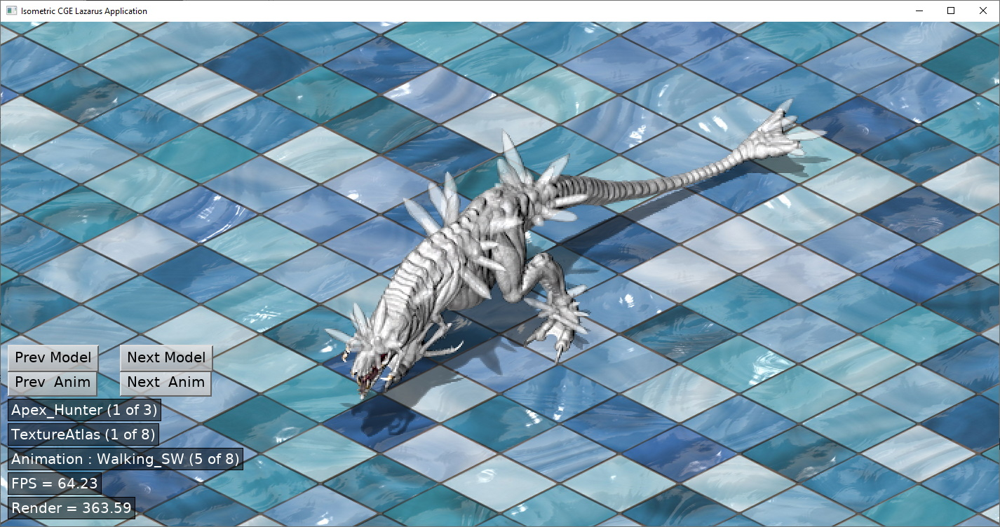

# SheetViewer

## Important

This project requires some graphical assets (a load of monsters) so you'll need to go and grab them from 

https://pvgames.itch.io/pvgames-free-assets-apex-predators

The assets are available for no payment (i.e. it's a Pay What You Want) but are licensed so can't be included in this repo (it's a 100+M download anyway)

Once you've got the ZIP file place it in the data directory and extract it in-place (not in a sub-directory)

There is already a PVGames_ApexPredators directory in data, this contains the Starling Texture Atlases. The ZIP will add the required PNG files that are not in this repo.

If you've extracted everything correctly the three following directories should contain 8 x *.starling.xml and 9 x *.png each

data/PVGames_ApexPredators/Apex_Hunter

data/PVGames_ApexPredators/Apex_Predator

data/PVGames_ApexPredators/Apex_Stalker

## Dependencies

[Lazarus](https://www.lazarus-ide.org/)

[Castle Engine](https://castle-engine.io/)

[PV Games Apex Predators](https://pvgames.itch.io/pvgames-free-assets-apex-predators)

## Build Instructions

This project is Lazarus, Castle Editor and build-tool friendly

##### To compile with Lazarus (the only option for MacOS)

Load SheetViewerLaz.lpi into Lazarus + compile

##### To compile with Castle-Editor

Open CastleEngineManifest.xml in Castle Editor and select Compile And Run from the Run menu item

##### To compile from the command line for Windows/Linux

castle-engine compile

./SheetViewerApp

##### To compile from the command line for Android

castle-engine package  --target=android

Install SheetViewerApp-debug.apk / SheetViewerApp-release.apk on a device

##### To compile from the command line for iOS

castle-engine package  --target=ios

Install on a device or use simulator

##### Copyright/Attribution Notice: 
Sprite created by Puffolotti Accident
